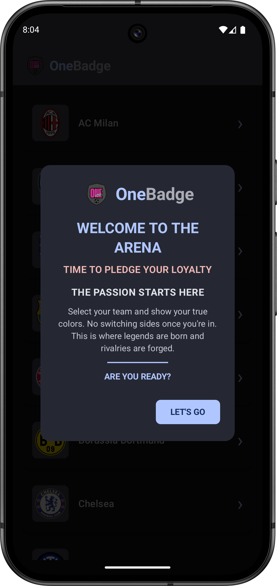
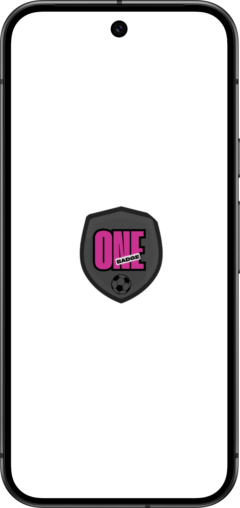

# One Badge

For fans who live and breathe their team.  
Whether you’re a diehard supporter of Barcelona, Man United, Real Madrid, or any local club – OneBadge lets you pick **your team** and stay connected with everything about them.  
Get **continuous updates** on next matches, league standings, top scorers, and even in-match **events** – all in one place!  

---

## 📦 Download the APK

Access the latest APK for **One Badge** from the link below:

---

## 🎢 Roadmap

### **v0.1.0**
- [x] Create HomeScreen  
- [x] Build **Swipe Card layout** with hardcoded dummy data  
- [x] Implement basic swipe animations  
- [x] Create placeholder card types:  
  - [x] Info  
  - [x] Next Match  
  - [x] Last Match  
  - [x] Top Scorer  
  - [x] League Standing  
- [x] Choose API (TheSportsDB or API-Football free tier)  
- [x] Setup **Retrofit**  
- [x] Display real API data in cards  
- [x] Add **Onboarding/Team Selection** screen with search  
- [x] Save team ID in **Room Database**  
- [x] Bind cards to selected team  
- [x] Replace default splash with animated Compose splash screen  
- [x] Gradient backgrounds in team colors  

---

### **v0.2.0 – Upcoming Features**
- [x] Cache last API data  
- [ ] Error states (Retry, “No data”)  
- [ ] Pull-to-refresh on Home  
- [ ] Share card as image/text  
- [ ] Animated transitions between cards  
- [ ] Card animations (scale, rotation, bounce)  
- [ ] Live countdown timer for next match  
- [ ] Settings screen:  
  - [ ] Change favourite team  
  - [ ] Toggle theme  
  - [ ] About app  
- [ ] Test on multiple screen sizes  
- [ ] App icon & branding  
- [ ] Final performance tweaks  
- [ ] Submit to Indus Appstore  
- [ ] **Live Events Feed** → match events like goals, red cards, substitutions  
- [ ] **Continuous Data Refresh** → auto-refresh during matches without manual pull  
- [ ] **Next Matches, League Standings, and Top Scorers** → updated continuously for chosen team  

---

## 📱 Screenshots

Here are some early previews from the app:

| Card Swipe | Carousel | Team List |
| :---------: | :-------: | :-------: |
|  |  |  |

| Home Screen | Splash Screen |
| :----------: | :------------: |
|  |  |

> *More previews coming soon as the UI evolves!*

---

